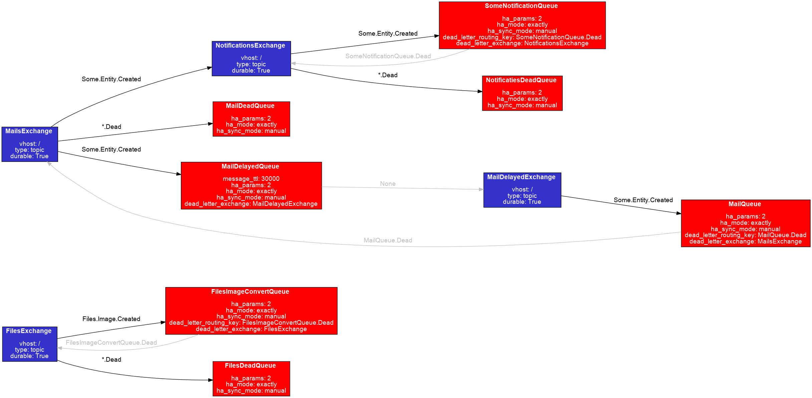

# rmq-topology

Generate RabbitMQ topology from a broker definition file.

## Requirements

- Graphviz
- Python3
- Packages from requirements.txt

## Usage

Generate dot file:
``` python
python ./app/generator.py -i <broker_file> -o <output_dot_file>
```

Generate png file:
``` bash
dot -Tpng -o ./sample/graph.png ./sample/out.dot
```

### Sample output


